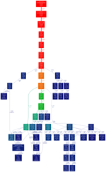

# TINKER

# Table of Contents

* [Overview](#overview)
* [Parallelisation strategy](#parallelisation-strategy)
* [Questions](#questions)
* [Changes](#changes)

# Overview

TINKER Software Tools for Molecular Design. This is development
version of the public GitHub [repository](https://github.com/jayponder/tinker) 
maintained by Jay Ponder.

This is the `repmem` branch which is exploring a replicated memory version
of:

* `dynamic`

Any other application may no longer work. We may also have a look at:

* `bar` which reads in two trajectories and two key files (i.e. different
lambda windows for free energy calculations), and calculates the energies
of trajectory 1 with key file 2, and vice versa. The read-in is very slow
on this, up to a few hours for ~2000 structures. Richard has been thinking
for a while that ideally the energy evaluation should be done as an option
to dynamic - i.e. whenever the energy of a structure is printed out, why
not evaluate the energy of the same structure at different lambda windows
too - this would save all the costly trajectory post-processing later.

# Parallelisation strategy

## Overview

Focus on routines that are used by Richard and Omar where possible.
Look at the OpenMP regions to determine where the current CPU cost is incurred as well as profiling a couple of use cases with vanilla-tinker to find out where the 
cost is.

* WF to profile:
  * JAC 
  * Water model with Verlet (as done by Omar)
  * Use case from Richard
* From the regions that are parallelised using OpenMP:
  * VdW in `ehal1.f`
  * Electrostatics and polarization in:
    * `empole1.f`
    * `induced.f`
  
## Stage 1

This stage will allow us to evaluate whether this strategy will work. Focus on the JAC execution path for now. General steps are:

1. **Profile** the latest version of `dynamic` for JAC without OpenMP. Need to understand quantitavely the performance.
2. Revisit the **execution path** of `dynamic` for the JAC benchmark.
3. **Split the loops** currently parallelised using OpenMP with MPI. 
4. Check that the correct output is still being produced from multiple-process runs compared to that from a single process.
5. Obtain a speed-up scalability curve. Consider cases with/without OpenMP (compiled with/without). Need to establish the efficacy of a hybrid approach.
6. Evaluate whether this is a good strategy.

If this works well we could move to a stage 2 that might take the
execution path produced with use cases provided by Richard.

### Profiling

### Execution path

Current content comes from an early write up by Weronika. Need to narrow
this down a bit.

The execution path for `dynamic.f` running JAC:

1. Set up the system (call `initial`, `getxyz`, `mechanic`).
2. Initialize variables and check for keywords.
3. Get the number of time steps, their length, the time between trajectory 
   snapshot coordinate dumps, the type of statistical ensemble, and constant 
   energy or temperature.
4. Initialize constraints and dynamics
5. Call integrator `nstep` times

Each integrator (`verlet`, `stochastic`, `bussi`, `nose` (Nose-Hoover),
`ghmcstep`, `rigidbody`, `respa` and `beeman`) calls the `gradient`
subroutine which then calls all the other subroutines to calculate the
potential energies and first derivatives.

in `gradient.f`:

1. Energy component are zeroed out.
2. Check for periodic conditions -> call `bounds`.
3. Update neighbor list -> call `nblist` (inside depending on parameters a 
   specific list is used, e.g. `vlist`, `clist`, `mlist`, `ulist`)
4. Replicates method -> call `replica`.
5. Check if Born radii is required (used in implicit solvation models) -> call `born`.
6. Alter bond and torsion constants (it seems that it only happens for pi systems) 
   -> call `picalc`
7. Call local geometry energy and gradient routines (13 possible subroutines)
8. Van der Waals energy calculations (5 possible subroutines)
9. Electrostatic energy calculations (5 possible subroutines)
10. Miscellaneous energy (4 possible subroutines).
11. summing all of the components of energy and first derivatives.

It seems that all of the subroutines that are called in `gradient.f` need to be (?) specified in the key input file. However, not all the possible
options specified in key files are used in gradient (e.g. `ewald`).

The following call graph was generated by running
[gprof2dot.py](https://code.google.com/p/jrfonseca/wiki/Gprof2Dot)
to convert output generated by
[callgrind](http://valgrind.org/docs/manual/cl-manual.html)
for a system running JAC for 10 time steps. Click on
the image to get a much larger version. This was run on
[indy](https://www.wiki.ed.ac.uk/display/EPCCIM/Industry+Machine+Wiki)
with *-g* and no OpenMP or optimisation.

Once the profile for `callgrind` had been generated used:

    ./gprof2dot.py -f callgrind -o dhfr.dot callgrind.out.5428
    dot -Tpng dhfr.dot -o dhfr.png

To produce a png file. The [graphviz](http://www.graphviz.org/) package
needs to be installed locally.

### Split the loops

Splitting up loops evenly is not going to suffice because iterating over
atoms does not lead to equal amounts of work. As the interactions are
symmetrical an atom at the beginning of the loop will interact with its
counterparts and its interactions will be taken into account so that as
one progresses over the neighbour list most of the interactions will have
already been taken into account entailing less and less work. Omar has,
more or less, run into this problem.

Current thinking is to associate a *cost* for each atom. This will then
help us perform a load balanced split of the loops across the different
processes. We know the cost will be:

* Proportional to the valence of the atom.
* The valence of the nearest neighbours up to a separation of the 5 direct bonds.
* Atoms with a lower id will have a higher cost because their interaction will count for both atoms.

By traversing the neighbour list it may be possible to associate this cost once.

However, Weronika has dome some preliminary work and determined that
something else is at play - we need to check whether interactions that
are further off from an atom have equal costs.

# Questions

* Had a discussion with Weronika as to whether we should make 
  modifications to file in situ or change renamed copies. We
  opted for the former but if several utilities use a single
  file and only one of the apps gets converted to MPI then 
  this will not work. 
* Should we use Fortran 90 derived types? This would reduce the number
  of communication calls that would be required. 

# Changes

Notable changes from the TINKER `master` branch are:

* Moved the `control` and `getkey` subroutines from 
  `basefile.f` to `getxyz.f` - it just seems to be 
  so much more logical to call them from there rather 
  than `basefile.f`.
* Only process 0 reads the key file in `getkey.f` and then 
  broadcasts the value of `nkey` (actual number of key lines)
  and the `keyline` array which contains the key contents.
* Added file `mpiparams.f` - a module to store the MPI parameters.
* Added file `help.f` that prints out usage information.
* Removed (or in the process of removing) stdin input to the 
  application. These will normally run in a batch environment
  where there is no direct connection between the user running
  the program and the application that is running. Attempts to
  get input would stall execution and waste CPU cycles.
* Including a `Makefile` in the `source` directory. Have included 
  a fairly large number of changes from the `Makefile` included 
  in the tinker distribution.
* The `fftw` has been moved from a top level directory in the TINKER
  distribution to live under the `thirdparty` subdirectory otherwise
  it confuses GitHub into thinking that TINKER is a C application.

